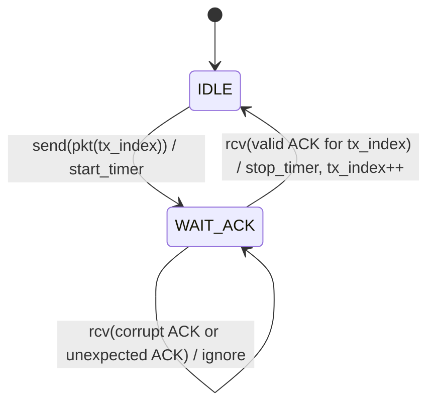
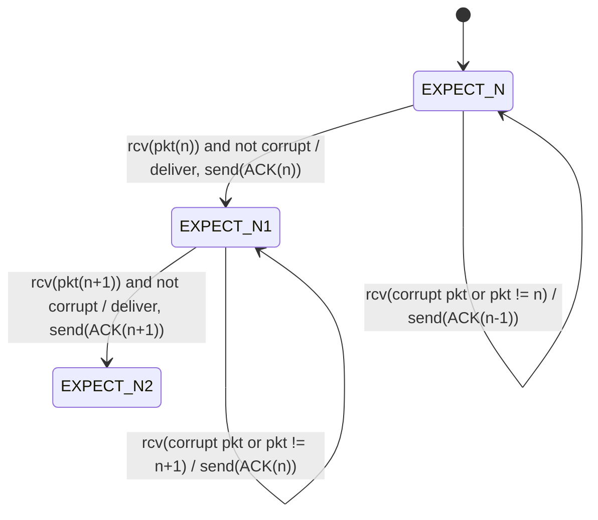
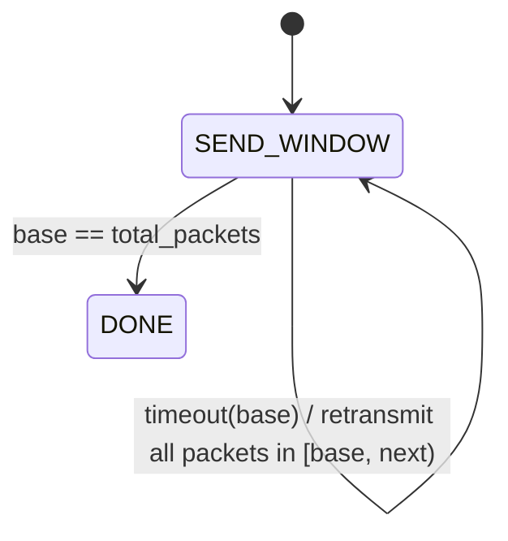
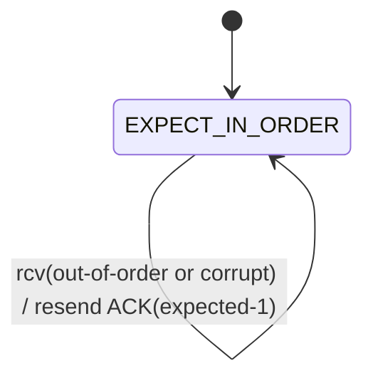
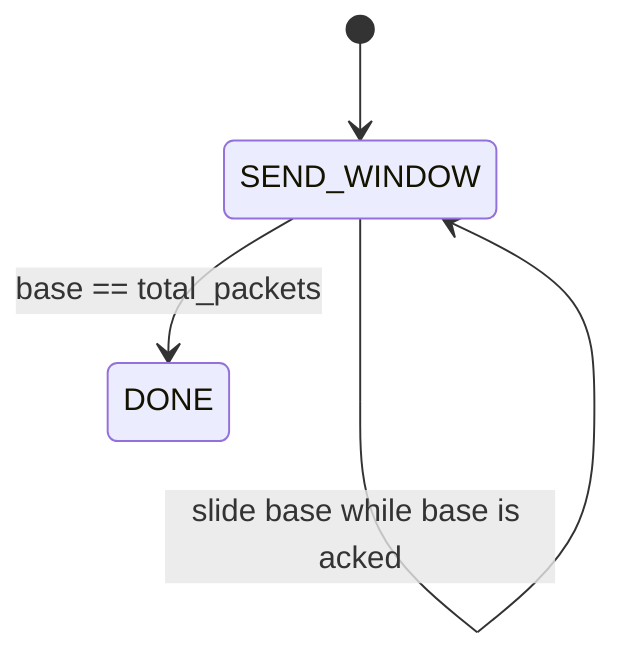
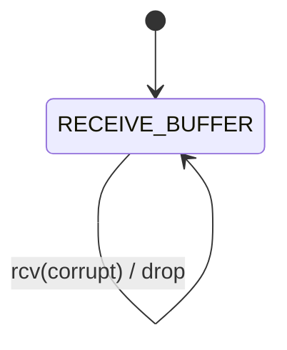

# Assignment 3 Report - Reliable Data Transfer

## 1) Brief Implementation Report

This project implements three reliable transport protocols over a simulated unreliable channel:

- rdt 3.0 (Stop-and-Wait)
- Go-Back-N (GBN)
- Selective Repeat (SR)

Implemented source files:

- `frame_unit.py`: `Frame` dataclass with sequence metadata, ACK metadata, digest generation, validation, and defensive copy support.
- `channel_core.py`: `UnreliableLink` event-driven channel with in-flight scheduling (drop/corrupt/delay behavior).
- `transport_fsm.py`: FSM-style sender/receiver logic in distinct classes: `StopWaitRDT`, `GoBackNProtocol`, and `SelectiveRepeatProtocol`.
- `run_lab.py`: CLI runner that generates configurable workloads and prints transition traces plus delivery verdict.

Key design points:

- A shared reliable-transfer foundation (`RDTPrimitiveCore`) is used by all three protocols.
- This shared core provides the rdt mechanisms (checksum validation, sequence/ACK handling, send/receive primitives, and timeout clock support), and GBN/SR build on top of it.
- Sequence numbers and ACK numbers are used for correctness and in-order delivery.
- Timeouts trigger retransmissions:
    - RDT3.0: resend current packet.
  - GBN: resend window from oldest unacknowledged packet.
  - SR: resend only timed-out unacknowledged packet(s).
- Channel behavior is configurable to test error handling under stochastic conditions.

---

## 2) FSM Diagrams (Sender + Receiver)

### A) rdt 3.0 (Stop-and-Wait)

#### Sender FSM



#### Receiver FSM



### B) Go-Back-N (GBN)

#### Sender FSM



#### Receiver FSM



### C) Selective Repeat (SR)

#### Sender FSM



#### Receiver FSM



---

## 3) Testing Scenarios and Results

### Required scenarios covered

- No packet loss or corruption
- Packet loss
- Packet corruption
- Delayed packets

### Observed results (executed in this workspace)

| Protocol | Scenario | Configuration Summary | Result |
|---|---|---|---|
| RDT3 | No loss/corruption | `loss=0, corrupt=0` | delivered `8/8`, in_order_complete `True` |
| RDT3 | Packet loss | `loss=0.25, corrupt=0` | delivered `8/8`, in_order_complete `True` |
| RDT3 | Packet corruption | `loss=0, corrupt=0.25` | delivered `8/8`, in_order_complete `True` |
| RDT3 | Delayed packets | `loss=0, corrupt=0, delay=[0.2,0.35]` | delivered `6/6`, in_order_complete `True` |
| GBN | No loss/corruption | `loss=0, corrupt=0` | delivered `8/8`, in_order_complete `True` |
| GBN | Packet corruption | `loss=0, corrupt=0.2` | delivered `10/10`, in_order_complete `True` |
| GBN | Loss + corruption stress | `loss=0.2, corrupt=0.1` | delivered `10/10`, in_order_complete `True` |
| GBN | Delayed packets | `loss=0, corrupt=0, delay=[0.2,0.35]` | delivered `8/8`, in_order_complete `True` |
| SR | No loss/corruption | `loss=0, corrupt=0` | delivered `8/8`, in_order_complete `True` |
| SR | Packet corruption | `loss=0, corrupt=0.2` | delivered `10/10`, in_order_complete `True` |
| SR | Loss + corruption stress | `loss=0.2, corrupt=0.1` | delivered `10/10`, in_order_complete `True` |
| SR | Delayed packets | `loss=0, corrupt=0, delay=[0.1,0.15]` | delivered `6/6`, in_order_complete `True` |

Conclusion:

- All three protocols recover from channel errors and complete delivery.
- Delivered data remained in-order and complete in tested scenarios.

---

## 4) How to Run

Follow these steps in any terminal (PowerShell, CMD, bash, zsh):

1. Open terminal in the project directory (the folder containing `run_lab.py`).
2. Optional but recommended: activate your virtual environment.
3. Run one protocol simulation (example: rdt3):

```bash
python run_lab.py --protocol rdt3
```

If `python` does not work on Windows, use:

```powershell
py -3 run_lab.py --protocol rdt3
```

Successful execution ends with:

```text
in_order_complete=True
```

Quick commands for each protocol:

```bash
python run_lab.py --protocol rdt3
python run_lab.py --protocol gbn
python run_lab.py --protocol sr
```

Main CLI options:

- `--protocol {rdt3,gbn,sr}`
- `--count` (number of packets/messages)
- `--packet-size` (payload size)
- `--window` (GBN/SR window size)
- `--timeout`
- `--loss`
- `--corrupt`
- `--delay-min --delay-max`
- `--max-ticks`
- `--step-sleep`
- `--seed`

---

## 5) How to Test (Commands)

### No packet loss or corruption

```bash
python run_lab.py --protocol rdt3 --count 8 --packet-size 8 --loss 0 --corrupt 0
```

```bash
python run_lab.py --protocol gbn --count 8 --packet-size 8 --window 4 --loss 0 --corrupt 0
```

```bash
python run_lab.py --protocol sr --count 8 --packet-size 8 --window 4 --loss 0 --corrupt 0
```

### Packet loss

```bash
python run_lab.py --protocol rdt3 --count 8 --packet-size 8 --loss 0.25 --corrupt 0 --timeout 0.25 --max-ticks 15000
```

```bash
python run_lab.py --protocol gbn --count 10 --packet-size 8 --window 4 --loss 0.2 --corrupt 0 --timeout 0.25 --max-ticks 30000
```

```bash
python run_lab.py --protocol sr --count 10 --packet-size 8 --window 4 --loss 0.2 --corrupt 0 --timeout 0.25 --max-ticks 30000
```

### Packet corruption

```bash
python run_lab.py --protocol rdt3 --count 8 --packet-size 8 --loss 0 --corrupt 0.25 --timeout 0.25 --max-ticks 15000
```

```bash
python run_lab.py --protocol gbn --count 10 --packet-size 8 --window 4 --loss 0 --corrupt 0.2 --timeout 0.25 --max-ticks 30000
```

```bash
python run_lab.py --protocol sr --count 10 --packet-size 8 --window 4 --loss 0 --corrupt 0.2 --timeout 0.25 --max-ticks 30000
```

### Delayed packets

```bash
python run_lab.py --protocol rdt3 --count 6 --packet-size 8 --loss 0 --corrupt 0 --delay-min 0.2 --delay-max 0.35 --timeout 0.5
```

```bash
python run_lab.py --protocol gbn --count 8 --packet-size 8 --window 4 --loss 0 --corrupt 0 --delay-min 0.2 --delay-max 0.35 --timeout 0.5
```

```bash
python run_lab.py --protocol sr --count 6 --packet-size 8 --window 4 --loss 0 --corrupt 0 --delay-min 0.1 --delay-max 0.15 --timeout 0.5
```

Expected success indicator in output:

- `in_order_complete=True`
